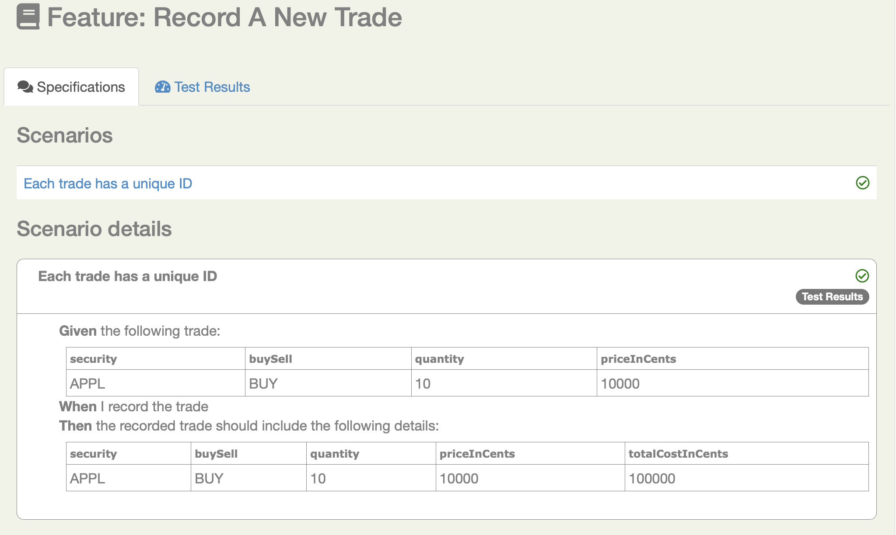
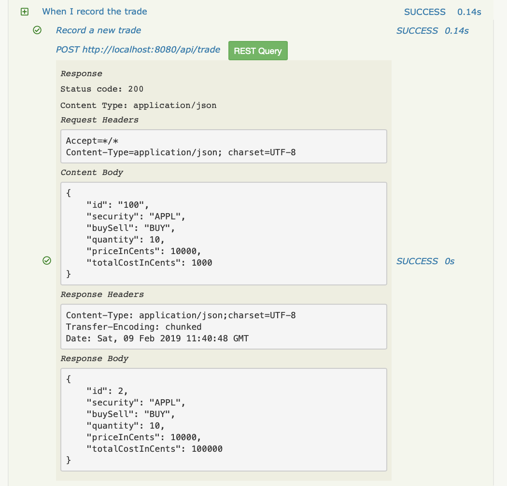

# Getting started with REST API testing with Serenity and Cucumber 4

This tutorial show you how to get started with REST-API testing using Serenity and Cucumber 4. 

## Get the code

Git:

    git clone https://github.com/serenity-bdd/serenity-rest-starter.git
    cd serenity-rest-starter


Or simply [download a zip](https://github.com/serenity-bdd/serenity-repository-starter/archive/master.zip) file.

## The starter project
The best place to start with Serenity and Cucumber is to clone or download the starter project on Github ([https://github.com/serenity-bdd/serenity-rest-starter](https://github.com/serenity-bdd/rest-cucumber4-starter)). 
This project gives you a basic project setup, along with some sample tests and supporting classes. 
The starter project comes bundled with a sample SpringBoot web service, and some RestAssured-based tests. 
The project also illustrates how you might use Freemarker to prepare test data for your scenarios.

### The project directory structure
The project has build scripts for both Maven and Gradle, and follows the standard directory structure used in most Serenity projects:
```Gherkin
src
  + main
  + test
    + java                                Test runners and supporting code
    + resources
      + features                          Feature files

          + status
          + trades
             record_a_new_trade.feature 
      + templates                         Freemarker templates and properties files                

```

### Adding the Cucumber 4 dependency
Serenity seamlessly supports both Cucumber 2.x and Cucumber 4. 
However, this flexibility requires a little tweaking in the build dependencies.

If you are using Maven, you need to do the following:
- exclude the default `cucumber-core` dependency from your `serenity-core` dependency
- Replace your `serenity-cucumber` dependency with the `serenity-cucumber4` dependency
- Add dependencies on the Cucumber 4.x version of `cucumber-java` and `cucumber-junit` into your project

An example of the correctly configured dependencies is shown below:
```xml
<dependency>
    <groupId>net.serenity-bdd</groupId>
    <artifactId>serenity-core</artifactId>
    <version>2.0.38</version>
    <scope>test</scope>
    <exclusions>
        <exclusion>
            <groupId>io.cucumber</groupId>
            <artifactId>cucumber-core</artifactId>
        </exclusion>
    </exclusions>
</dependency>
<dependency>
    <groupId>net.serenity-bdd</groupId>
    <artifactId>serenity-cucumber4</artifactId>
    <version>1.0.4</version>
    <scope>test</scope>
</dependency>
<dependency>
    <groupId>io.cucumber</groupId>
    <artifactId>cucumber-java</artifactId>
    <version>4.2.0</version>
</dependency>
<dependency>
    <groupId>io.cucumber</groupId>
    <artifactId>cucumber-junit</artifactId>
    <version>4.2.0</version>
</dependency>
```

If you are using Gradle, you need to ensure that the 4.x version of `cucumber-core` is used using the _resolutionStrategy_ element, and also add the Cucumber 4.x version of `cucumber-java` and `cucumber-junit` dependencies as mentioned above:
```Gradle
configurations.all {
    resolutionStrategy {
        force "io.cucumber:cucumber-core:4.2.0"
    }
}

dependencies {
    testCompile "net.serenity-bdd:serenity-core:2.0.38",
                "net.serenity-bdd:serenity-cucumber4:1.0.4",
                "io.cucumber:cucumber-core:4.2.0",
                "io.cucumber:cucumber-junit:4.2.0"
}
```

In the rest of this article, we will walk through some of the highlights of both versions. Let’s start off with the version on the master branch, which uses lightweight page objects and actions.

## A simple GET scenario
The project comes with two simple scenarios, one that illustrates a GET, and a second that illustrates a POST.

The first scenario exercises the `/api/status` endpoint
Both variations of the sample project uses the sample Cucumber scenario. 
In this scenario, Sergey (who likes to search for stuff) is performing a search on the DuckDuckGo search engine:

```Gherkin
  Scenario: Application status end-point
    Given the application is running
    When I check the application status
    Then the API should return "Serenity REST Starter project up and running"
```

The glue code for this scenario illustrates the layered approach we find works well for both web and non-web acceptance tests.
The glue code is responsible for orchestrating calls to a layer of more business-focused classes, which perform the actual REST calls.

```java
    @Steps
    ApplicationStatus theApplication;

    @Given("the application is running")
    public void the_application_is_running() {
        assertThat(theApplication.currentStatus()).isEqualTo(RUNNING);
    }

    @When("I check the application status")
    public void i_check_the_application_status() {
        theApplication.readStatusMessage();
    }
```

The actual REST calls are performed using RestAssured in the action classes, like `ApplicationStatus` here. 
These use either RestAssured (if we don't want the queries to appear in the reports) or SerenityRest (if we do):

```java
public class ApplicationStatus {

    public AppStatus currentStatus() {
        int statusCode = RestAssured.get(STATUS.getUrl()).statusCode();
        return (statusCode == 200) ? AppStatus.RUNNING : AppStatus.DOWN;
    }

    @Step("Get current status message")
    public void readStatusMessage() {
        SerenityRest.get(STATUS.getUrl());
    }
}
```

In steps that perform assertions, we can also use the `SerenityRest.restAssuredThat()` helper method, 
which lets us make a RestAssured assertion on the last response the server sent us:

```java

    @Then("the API should return {string}")
    public void the_API_should_return(String expectedMessage) {
        restAssuredThat(lastResponse -> lastResponse.body(equalTo(expectedMessage)));
    }
```


## A more complex scenario

The other sample scenario performs a POST query:

```gherkin
Feature: Record a new trade

  Scenario: Each trade has a unique ID
    Given the following trade:
    | security | buySell | quantity | priceInCents |
    | APPL     | BUY     | 10       | 10000        |
    When I record the trade
    Then the recorded trade should include the following details:
      | security | buySell | quantity | priceInCents | totalCostInCents |
      | APPL     | BUY     | 10       | 10000        | 100000           |

```

The _Given_ step uses a Freemarker template to merge the data in the Cucumber table with values defined in a properties file -
to see how this works in detail, have a look at the `MergeFrom` class.

```java
    @Given("the following trade:")
    public void the_folowing_trade(List<Map<String, String>> tradeDetails) throws IOException {

        trade = MergeFrom.template("templates/trade.json")
                         .withDefaultValuesFrom(FieldValues.in("templates/standard-trade.properties"))
                         .withFieldsFrom(tradeDetails.get(0));
    }
```

Once the message to be posted has been prepared, we use another action class (`tradingSystem`) to perform the post:

```java
    @Steps
    RecordNewTrade recordNewTrade;
   
    @When("I record the trade")
    public void i_record_the_trade() {
        recordNewTrade.withDetails(trade);
    }
```

The `RecordNewTrade` class is responsible for posting this query to the end point, as shown below:

```java
public class RecordNewTrade {

    @Step("Record a new trade")
    public void withDetails(String trade) {
        SerenityRest.given()
                .contentType("application/json")
                .header("Content-Type", "application/json")
                .body(trade)
                .when()
                .post(WebServiceEndPoints.TRADE.getUrl());
    }
}
```

The last step checks that the total cost has been recorded correctly in the trade. 
In a real project, this would typically be implemented via another REST call or by a database query, but here 
we are illustrating how we can get and compare tabular data from JSON responses. 

```java
    @Steps
    TradeResponse theTradeDetails;
  
    @Then("the recorded trade should include the following details:")
    public void the_recorded_trade_should_contain_the_following_details(List<Map<String, String>> tradeDetails) {
        restAssuredThat(response -> response.statusCode(200));

        Map<String, String> expectedResponse = tradeDetails.get(0);
        Map<String, String> actualResponse = theTradeDetails.returned();

        assertThat(actualResponse).containsAllEntriesOf(expectedResponse);
    }
```

The `TradeResponse` class is responsible for retrieving the latest REST response and converting it to a map of strings.
```java
public class TradeResponse {
    public Map<String, String> returned() {
       return mapOfStringsFrom(SerenityRest.lastResponse().getBody().as(Map.class));
    }

    private Map<String,String> mapOfStringsFrom(Map<String, Object> map) {
        return map.entrySet()
                .stream()
                .collect(toMap(Map.Entry::getKey,
                        entry -> entry.getValue().toString()));
    }
}
```

## Living documentation

You can generate full Serenity reports by running `mvn clean verify`. 
This includes both the living documentation from the feature files:



And also details of the REST requests and responses that were executed during the test:




## Want to learn more?
For more information about Serenity BDD, you can read the [**Serenity BDD Book**](https://serenity-bdd.github.io/theserenitybook/latest/index.html), the official online Serenity documentation source. Other sources include:
* **[Byte-sized Serenity BDD](https://www.youtube.com/channel/UCav6-dPEUiLbnu-rgpy7_bw/featured)** - tips and tricks about Serenity BDD
* [**Serenity BDD Blog**](https://johnfergusonsmart.com/category/serenity-bdd/) - regular articles about Serenity BDD
* [**The Serenity BDD Dojo**](https://serenitydojo.teachable.com) - Online training on Serenity BDD and on test automation and BDD in general.
